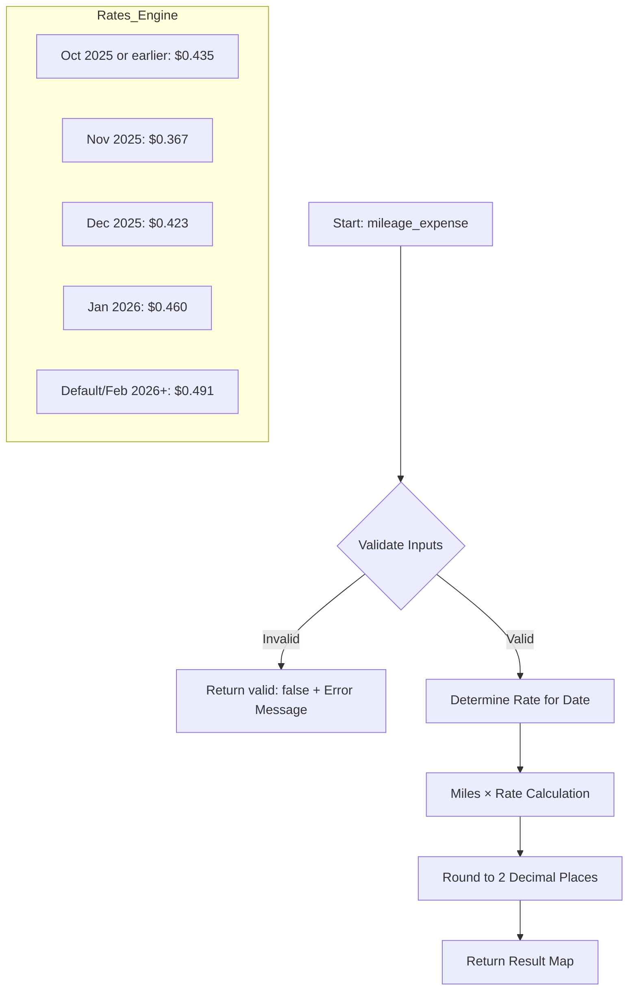
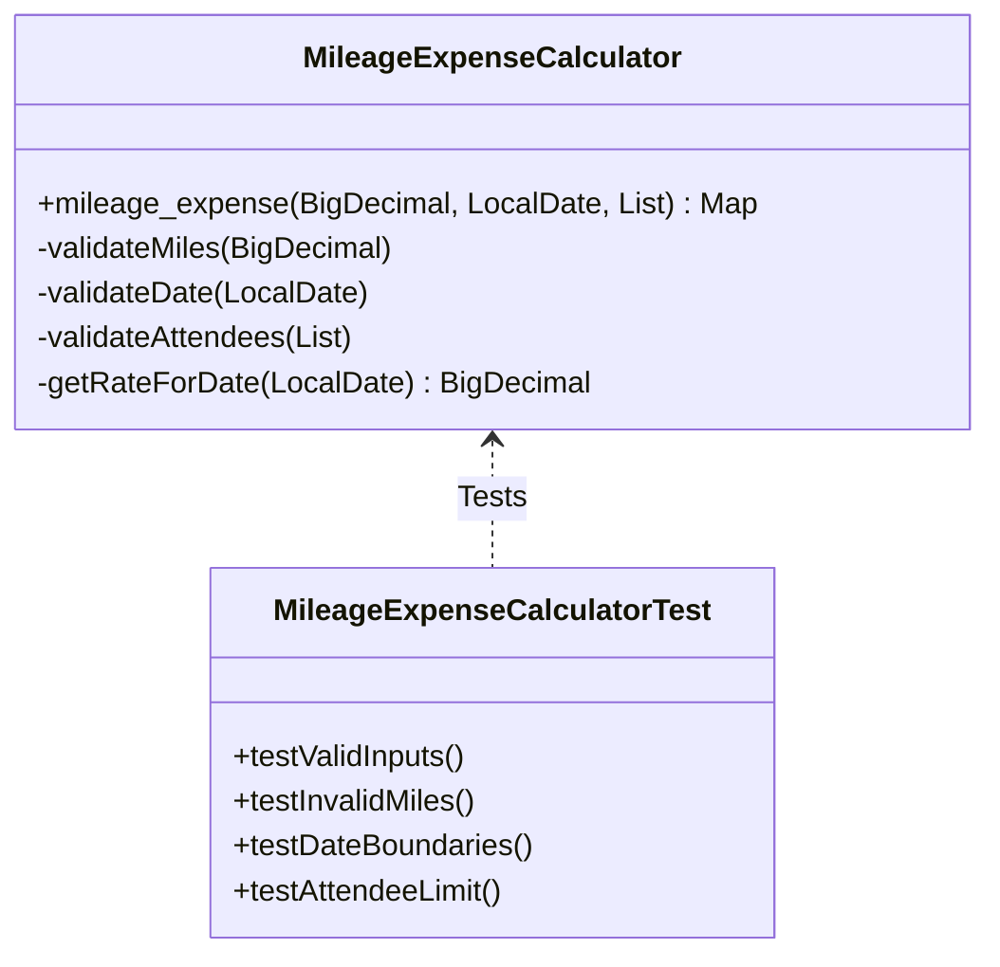

# 🚗 Zact Coding Practices - Mileage Expense Calculator


A clean, robust Java-based solution for calculating mileage expenses with proper validation and precise financial arithmetic, designed for professional coding assessments.

---

## 📖 Project Overview

This project implements a **Mileage Expense Calculator** that calculates reimbursement amounts based on miles driven, date of travel (determining the rate), and attendee list. It prioritizes financial precision using `BigDecimal` and robust input validation.

### Core Logic Features:
-   **Multi-Period Rate System**: Automatically selects the correct mileage rate ($0.367 to $0.491) based on the specific month/year.
-   **Financial Precision**: Uses `BigDecimal` with `HALF_UP` rounding to avoid floating-point errors common in financial calculations.
-   **Structured Error Handling**: Returns a `Map<String, Object>` (JSON-ready) instead of throwing exceptions for validation errors.
-   **Comprehensive Validation**: Checks for nulls, positive values, date validity, and attendee limits (max 5).

---

## 📊 System Architecture

### Process Flow Diagram
The following diagram illustrates the internal logic of the `mileage_expense` function:



### Class Structure


---

## 🛠️ Tech Stack & Implementation Patterns

-   **Language**: Java 17+ (LTS)
-   **Build Tool**: Maven
-   **Testing Framework**: TestNG (chosen for better data-driven testing)
-   **Patterns**:
    -   **Validation Guards**: Centralized validation methods to ensure fail-fast behavior.
    -   **Map-based Results**: Facilitates easy integration with REST APIs and JSON serializers.
    -   **Precision Math**: `BigDecimal` for zero-loss arithmetic.

---

## 🚀 Installation & Local Setup

To get this project running on your local machine, follow these steps:

### 1. Prerequisites
Ensure you have the following installed:
-   **Java JDK 17** or higher
-   **Apache Maven** 3.8+
-   **Git** (optional, for cloning)

### 2. Clone the Repository
```bash
git clone https://github.com/karanAtreya1986/zact_coding_practices.git
cd zact_coding_practices
```

### 3. Build the Project
Run the following command in the root of the `coding_rounds` directory:
```bash
cd coding_rounds
mvn clean install
```

---

## 🧪 How to Run Tests

### Via Command Line (Maven)
Navigate to the `coding_rounds` folder and run:
```bash
mvn test
```

### Via IDE (IntelliJ / Eclipse)
1.  Import the project as a **Maven Project**.
2.  Navigate to `src/test/java/codes_all/MileageExpenseCalculatorTest.java`.
3.  Right-click the file and select **Run 'MileageExpenseCalculatorTest'** (ensure you have the TestNG plugin installed).

---

## 📂 Project Structure

```text
zact_coding_practices/
├── coding_rounds/           # Main Assessment Module
│   ├── src/
│   │   ├── test/
│   │   │   └── java/
│   │   │       └── codes_all/ # Core logic & tests (placed here for easier assessment review)
│   │   │           ├── MileageExpenseCalculator.java
│   │   │           ├── MileageExpenseCalculatorTest.java
│   │   │           └── ... 
│   ├── pom.xml              # Maven dependencies (TestNG)
├── program_practice/        # General Java practice scratchpad
│   └── src/
└── README.md                # Project documentation
```

---

## 🛡️ Security & Secrets
This project follows security best practices:
-   No hardcoded secrets or API keys.
-   `.gitignore` is configured to exclude IDE metadata and build artifacts (`target/`, `.settings/`, etc.).

---

## 📤 Pushing Changes to GitHub

To update the remote repository with your latest changes:

```bash
# 1. Add changes
git add .

# 2. Commit
git commit -m "docs: improve README with architecture diagrams and setup instructions"

# 3. Push
git push origin main
```

---

> [!NOTE]
> **Why use Map as return type?**
> We return a `Map<String, Object>` to simulate a JSON response structure. This approach makes the core logic "clean" and "adaptable" for downstream systems like web servers where JSON is the standard.

Developed by [Karan Atreya](https://github.com/karanAtreya1986).
