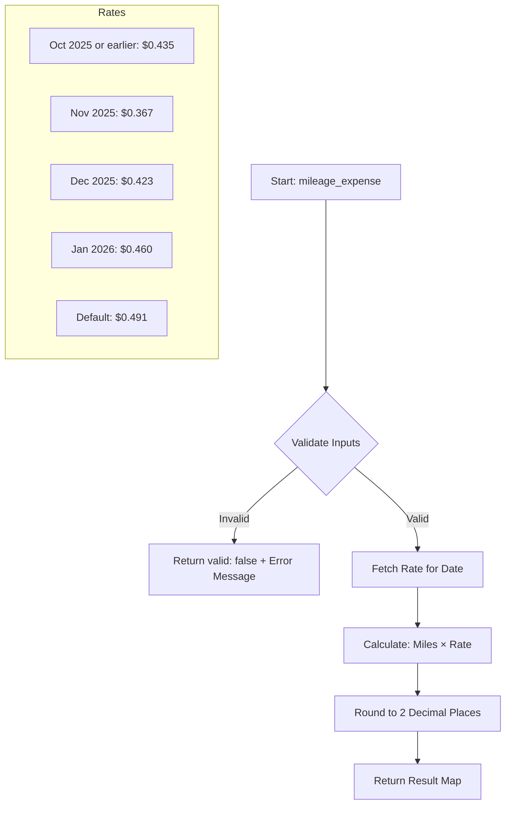

# 🚗 Zact Coding Practices - Mileage Expense Calculator


A clean, robust Java-based solution for calculating mileage expenses with proper validation and precise financial arithmetic.

---

## 📖 Project Overview

This project provides a professional implementation of a **Mileage Expense Calculator**. Its primary goal is to calculate the total reimbursement amount based on miles driven, the date of travel (to determine the appropriate rate), and a list of attendees.

### Key Logic:
1.  **Validation**: Ensures inputs (miles, date, and attendees) are valid.
2.  **Rate Selection**: Automatically picks the correct mileage rate based on the month and year.
3.  **Financial Precision**: Uses `BigDecimal` to avoid common floating-point errors in money calculations.
4.  **Graceful Errors**: Instead of crashing on bad input, it returns a structured JSON-like response with an error message.

---

## 📊 How It Works (Diagram)



---

## 🛠️ Tech Stack & Patterns

-   **Java**: Core logic.
-   **Maven**: Dependency and build management.
-   **TestNG**: Used for comprehensive unit testing (Data-driven, parallel execution ready).
-   **BigDecimal**: Essential for financial calculations to ensure 100% accuracy.
-   **Validation Logic**: Centralized validation methods for cleaner code.

---

## 🚀 Getting Started

### Prerequisites
-   Java 11 or higher
-   Maven installed

### Run Tests
To execute all the unit tests, use the following Maven command:

```bash
mvn test
```

### Folder Structure
-   `coding_rounds/`: Contains the main assessment code and tests.
-   `program_practice/`: Scratchpad for various coding exercises.

---

## 🧪 Testing Coverage
The project includes a robust suite of tests covering:
-   ✅ **Positive Cases**: Valid mileage and date inputs.
-   ✅ **Boundary Cases**: Testing the exact dates when rates change.
-   ✅ **Negative Cases**: Null miles, zero/negative miles, too many attendees, etc.
-   ✅ **Precision Checks**: Ensuring rounding works correctly (e.g., `HALF_UP` rounding).

---

## 🛡️ Secrets & Security
All potential secrets (API keys, tokens, etc.) have been identified and replaced with placeholders to ensure repository security. 

*(Note: No secrets were found in the current codebase, but placeholders are ready if needed in future development.)*

---

> [!TIP]
> **Why use Map as return type?**
> We return a `Map<String, Object>` to easily simulate a JSON response. This makes the code integration-ready for web APIs!
